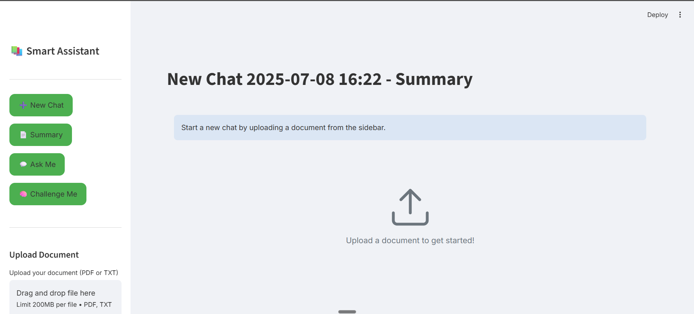
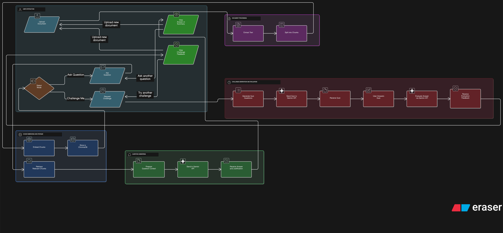

# Smart Document Assistant 📚

## Overview

The Smart Document Assistant is an AI-powered interactive tool built with Streamlit that allows users to seamlessly interact with their documents. It leverages advanced Retrieval-Augmented Generation (RAG) techniques, Google's Gemini API, and a local ChromaDB instance to provide intelligent Q&A, comprehensive summarization, and an engaging "Challenge Me" quiz mode based on your uploaded content. This project aims to transform how you absorb information from lengthy documents by making it interactive and efficient.

## Demo

### 🎥 Video Demo
[](https://www.loom.com/share/123e7fe477b849898480e4038200c998?sid=7d9790e1-869b-4cf2-9224-978ae51e8b47)

### 📸 Screenshots


## Features

- **Document Upload & Processing**: Easily upload PDF and text (.txt) documents for analysis and interaction.

- **Intelligent Q&A**: Ask questions about your document, and receive accurate answers grounded in the document's content, complete with justifications.

- **Automatic Summarization**: Get concise summaries of uploaded documents to quickly grasp the main points.

- **Challenge Mode**: Test your comprehension with AI-generated, logic-based questions derived from the document. The system also evaluates your answers and provides detailed justifications and scores.

- **Persistent Chat Sessions**: Your chat history, document uploads, and generated data are automatically saved and can be reloaded for continuous interaction across sessions, thanks to ChromaDB.

- **Retrieval-Augmented Generation (RAG)**: Utilizes a robust RAG pipeline with ChromaDB for efficient semantic search and context retrieval, ensuring answers are directly relevant to the document content.

- **User-Friendly Interface**: An intuitive and interactive web application built with Streamlit for a smooth user experience.


## Tech Stack

- **Framework**: Streamlit
- **Large Language Model (LLM)**: Google Generative AI (Gemini API - gemini-2.0-flash)
- **Vector Database**: ChromaDB
- **Embeddings**: Sentence Transformers (nomic-ai/nomic-embed-text-v1.5)
- **PDF Processing**:
  - PyPDF2
  - pdf2image (requires Poppler)
  - PyTesseract (requires Tesseract OCR)
- **Environment Management**: python-dotenv
- **Other Libraries**: einops

## Flow Diagram


## Installation

Follow these steps to set up the project locally:

### 1. Clone the repository

```bash
git clone https://github.com/your-username/smart-document-assistant.git
cd smart-document-assistant
```

### 2. Create a Python virtual environment (recommended)

```bash
python -m venv venv
```

### 3. Activate the virtual environment

**On macOS/Linux:**
```bash
source venv/bin/activate
```

**On Windows:**
```bash
.\venv\Scripts\activate
```

### 4. Install the required Python packages

```bash
pip install -r requirements.txt
```

### 5. Set up Google Gemini API Key

1. Obtain your `GEMINI_API_KEY` from the [Google AI Studio](https://aistudio.google.com/).
2. Create a file named `.env` in the root directory of your project.
3. Add your API key to the `.env` file:

```env
GEMINI_API_KEY="YOUR_GEMINI_API_KEY"
```

### 6. Install Poppler (for pdf2image)

pdf2image requires Poppler to be installed on your system.

**Windows**: Download a pre-compiled binary from [here](https://blog.alivate.com.au/poppler-windows/). Extract it and add the bin directory to your system's PATH.

**macOS (using Homebrew):**
```bash
brew install poppler
```

**Linux (Debian/Ubuntu):**
```bash
sudo apt-get install poppler-utils
```

### 7. Install Tesseract OCR (for pytesseract)

pytesseract requires Tesseract OCR to be installed on your system.

**Windows**: Download the installer from the [Tesseract GitHub](https://github.com/UB-Mannheim/tesseract/wiki). Make sure to add it to your system's PATH during installation, or manually set the `pytesseract.pytesseract.tesseract_cmd` variable in `mod.py`.

**macOS (using Homebrew):**
```bash
brew install tesseract
```

**Linux (Debian/Ubuntu):**
```bash
sudo apt-get install tesseract-ocr
```

## Usage

To run the Streamlit application, execute the following command from the project's root directory while your virtual environment is active:

```bash
streamlit run main.py
```

This will open the application in your web browser.

## Folder Structure

```
.
├── main.py                     # Main Streamlit application entry point
├── mod.py                      # Document processing utilities (text extraction, chunking)
├── rag.py                      # Retrieval-Augmented Generation (RAG) system with ChromaDB and embeddings
├── ask_anything.py             # AI functionalities for Q&A and summarization using Gemini API
├── challenge_me.py             # AI functionalities for generating and evaluating challenge questions using Gemini API
├── requirements.txt            # List of Python dependencies
├── .env.example                # Example file for environment variables
└── local_chroma_db/            # (Automatically created) Directory for ChromaDB persistence
```

## Contributing

We welcome contributions to the Smart Document Assistant! Here's how you can help make this project better:

### Getting Started

1. **Fork the repository** and clone it to your local machine
2. **Create a new branch** for your feature or bug fix:
   ```bash
   git checkout -b feature/your-feature-name
   ```
3. **Set up the development environment** following the installation instructions above

### How to Contribute

#### 🐛 Reporting Bugs
- Check if the issue already exists in the [Issues](https://github.com/your-username/smart-document-assistant/issues) section
- If not, create a new issue with:
  - Clear description of the problem
  - Steps to reproduce
  - Expected vs actual behavior
  - Your environment details (OS, Python version, etc.)

#### 💡 Suggesting Features
- Open an issue with the `enhancement` label
- Describe the feature and its benefits
- Provide examples or mockups if possible

#### 🔧 Code Contributions

**Areas where we need help:**
- Adding support for more document formats (Word, PowerPoint, etc.)
- Improving OCR accuracy and performance
- Enhancing the UI/UX
- Adding more embedding models
- Performance optimizations
- Writing tests
- Documentation improvements

**Before submitting a pull request:**
1. Ensure your code follows Python best practices (PEP 8)
2. Test your changes thoroughly
3. Update documentation if needed
4. Make sure your code doesn't break existing functionality

### Pull Request Process

1. **Update documentation** for any new features
2. **Add tests** for new functionality when possible
3. **Ensure all tests pass** (if test suite exists)
4. **Write clear commit messages** following conventional commits format:
   ```
   feat: add support for Word documents
   fix: resolve PDF parsing issue with special characters
   docs: update installation instructions
   ```
5. **Submit your pull request** with:
   - Clear title and description
   - Reference to related issues
   - Screenshots/GIFs for UI changes

### Development Guidelines

- **Code Style**: Follow PEP 8 guidelines
- **Documentation**: Use docstrings for functions and classes
- **Error Handling**: Implement proper error handling and logging
- **Dependencies**: Avoid adding unnecessary dependencies
- **Environment**: Test in both development and production environments

### Need Help?

- Check the [Issues](https://github.com/your-username/smart-document-assistant/issues) section for existing discussions
- Feel free to ask questions in issue comments
- For major changes, consider opening an issue first to discuss the approach


## Acknowledgements

- **Google Generative AI (Gemini API)**: Powers the core AI capabilities for question answering, summarization, and challenge generation.
- **Streamlit**: Provides the interactive web application framework.
- **ChromaDB**: Used for local vector database persistence and efficient document retrieval.
- **Sentence Transformers**: Enables high-quality text embeddings for semantic search.
- **PyPDF2, pdf2image, PyTesseract**: Essential for robust document text extraction.
